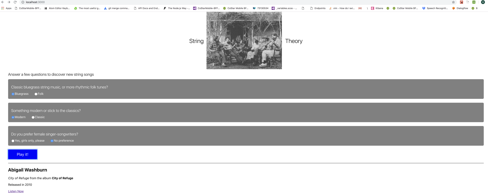

A React/Express App - answer three simple questions to discover new and old string tunes that are tailored to your mood

Stack:
- React 16.7.0 (Bootstrapped with Create React App)
- Express 4.16.4
- Node 8.1.1

To run locally, clone repository and do the following:
## Server Setup
1. At the root level, 'run npm install' and 'npm run build'
2. To start the server on Port 5000: run node server.js 

## Client Setup
1. CD into the 'Client' folder
2. run 'npm install' and 'npm run build'
3. run 'npm run start' to start the client on Port 3000

## Areas for Improvement
1. Add logic + error handling to radio buttons so that only one radio button can be selected per question (when one is selected, the other is de-selected)
2. Reset radio buttons to empty on Submit
3. Would be great to scrape data from an API with larger data set, but might lose the filtering capability based on all-female singers
4. Break out radio-buttons on Main.js into separate component files in src/components

